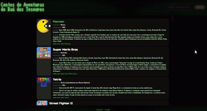
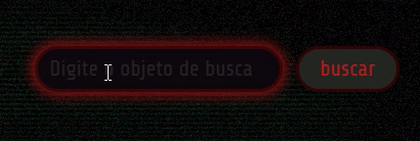
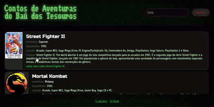
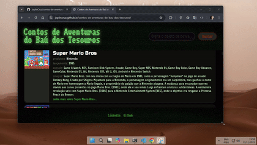

# 🏴‍☠️ Contos de Aventuras do Baú dos Tesouros

Bem-vindo ao Baú dos Tesouros! Este projeto é uma celebração nostálgica e uma biblioteca interativa dedicada aos jogos de arcade vintage que não apenas definiram uma era, mas também estabeleceram as fundações para muitos algoritmos e mecânicas de jogos que utilizamos até hoje.

Como um verdadeiro baú de pirata, este repositório guarda "tesouros" de valor inestimável: os clássicos que nos proporcionaram inúmeras horas de aventura e desafio. Explore, pesquise e redescubra as joias que moldaram a história dos videogames.

## 🚀 Sobre o Projeto

O objetivo é criar uma interface simples e elegante para catalogar e exibir informações sobre jogos de arcade icônicos. Cada jogo é apresentado como um "cartão de tesouro", contendo detalhes como:

- Título e imagem de capa.
- Ano de lançamento e desenvolvedora.
- Descrição da sua história e impacto.
- Uma lista de tags para facilitar a busca por gênero ou característica.
- Link para jogar (quando disponível) e para saber mais.

## ✨ Funcionalidades

- **Galeria de Tesouros:** Navegue por uma coleção de mais de 60 jogos clássicos. \
  
- **Busca Inteligente:** Utilize a barra de pesquisa para encontrar jogos por título, empresa, console ou tags (ex: "Luta", "Atari", "1985"). \
  
- **Visualização Detalhada:** Clique em um card para abrir uma janela flutuante com informações completas sobre o jogo, sem sair da página. \
  
- **Design Responsivo:** A experiência é otimizada para visualização tanto em desktops quanto em dispositivos móveis. \
  

## 🛠️ Tecnologias Utilizadas

Este projeto foi construído com tecnologias web fundamentais, focando na simplicidade e performance:

- **HTML5:** Para a estrutura semântica do conteúdo.
- **CSS3:** Para a estilização, layout (Flexbox) e responsividade.
- **JavaScript (Vanilla):** Para a manipulação do DOM, lógica de busca, e interatividade da interface.
- **JSON:** A base de dados dos jogos é armazenada localmente em um arquivo `gameDatabase.json`, sendo carregada e processada dinamicamente.

## ⚙️ Como Executar

Por ser um projeto front-end puro, não há necessidade de um servidor ou dependências complexas.

1.  Clone este repositório:
    ```bash
    git clone https://github.com/JoplinCruz/contos-de-aventuras-do-bau-dos-tesouros.git
    ```
2.  Navegue até o diretório do projeto:
    ```bash
    cd imersao-dev-gemini
    ```
3.  Abra o arquivo `index.html` em seu navegador de preferência.

ou acesse o site clicando no link abaixo:
<https://joplincruz.github.io/contos-de-aventuras-do-bau-dos-tesouros/>

Pronto! A aventura já pode começar.

## 🔮 Próximos Passos

O baú sempre pode guardar mais tesouros! Algumas ideias para futuras implementações:

- [ ] Adicionar mais jogos à base de dados.
- [ ] Implementar um sistema de filtros avançados (por ano, por console, etc.).
- [ ] Criar uma funcionalidade de "Jogo Aleatório" para surpreender o usuário.
- [ ] Adicionar um tema escuro para uma navegação noturna mais confortável.
- [ ] Paginação para lidar com um número ainda maior de jogos.

## 👤 Autor

- Linkedin
- Github
